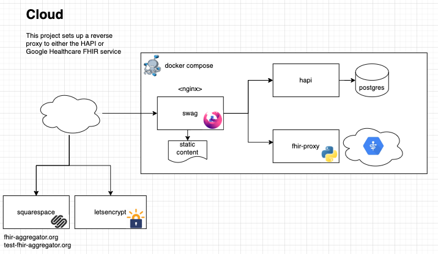

# Overview

This project contains configurations for the SWAG reverse proxy to a local instance of the [HAPI FHIR server](https://hapifhir.io/) and a proxy to the [Google Healthcare API](https://cloud.google.com/healthcare-api/docs/concepts/fhir).

* SSL termination
* Reverse proxy
* HAPI FHIR server
* Google Healthcare API
* Static html pages
 


# Prerequisites

- Access to a GCP instance (e.g. `e2-highmem-2)
- The Google Healthcare API is enabled and the FHIR store is created

> [!TIP]
>
> See [`Google-setup.md`](Google-setup.md) for more details

# Usage

## 1. Build the Proxy to the Google Healthcare API

> [!TIP]
>
> See [`google-fhir-proxy/README.md`](google-fhir-proxy/README.md) for more details

```sh
➜ cd google-fhir-proxy

➜ docker build . -t google-fhir --no-cache
```

## 2. Start the Server

```sh
➜ docker compose up
```

## 3. Verify that the Server is Running

```bash
➜ docker compose ps
NAME          IMAGE                             COMMAND                  SERVICE       PORTS
google-fhir   google-fhir                       "python proxy.py"        google-fhir   0.0.0.0:8090->8080/tcp, [::]:8090->8080/tcp
hapi          hapiproject/hapi:v7.4.0           "java --class-path /…"   hapi          0.0.0.0:8080->8080/tcp, :::8080->8080/tcp
postgres      postgres:15-alpine                "docker-entrypoint.s…"   postgres      5432/tcp
swag          lscr.io/linuxserver/swag:latest   "/init"                  swag          0.0.0.0:80->80/tcp, :::80->80/tcp, 0.0.0.0:443->443/tcp, :::443->443/tcp
```

## 4. Configure the Endpoint

```sh
# copy the subdirectories under the `./swag-config` directory to SWAG's `./config` directory
➜ cp -r swag-config/* config/
# (for HAPI) add passwords to config/nginx/.htpasswd
# e.g. htpasswd config/nginx/.htpasswd user password
 
# restart the reverse proxy
➜ docker compose restart swag
```

## 5. Load Data

- [HAPI](https://github.com/FHIR-Aggregator/hapi?tab=readme-ov-file#load-the-data) FHIR Server

- [Google Healthcare API](https://github.com/FHIR-Aggregator/healthcare-api/blob/development/README.md#import-data)

## 6. Query the Servers

```sh
➜ curl -s https://hapi.test-fhir-aggregator.org/fhir/'Patient?_total=accurate&_count=0'  | jq .total

➜ curl -s https://google-fhir.test-fhir-aggregator.org/'Patient?_total=accurate&_count=0' | jq .total
```

> [!NOTE]
>
> Static content is served from the `./swag-config/www` directory
