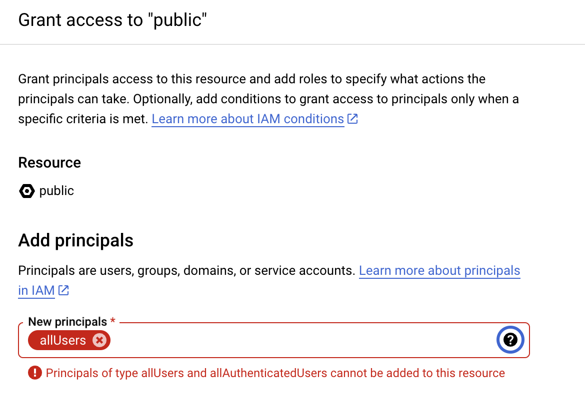

# Google FHIR Proxy

## Overview

* A proxy to the [Google Healthcare API](https://cloud.google.com/healthcare-api/docs/concepts/fhir) that provides a **READ ONLY (GET)** RESTful interface to the FHIR resources stored in the Google Healthcare API.
* A proxy is required because the Google Healthcare API does not support CORS or public access.


## Collaborations & dependencies
* The service has been created and the full url is known see [.env](../.env-sample) for details.
* The nginx (swag) proxy has been configured to forward requests to the service. See [swag-config](../swag-config) for details.

## Functionality
* The proxy forwards **GET** requests to the Google Healthcare API.
* The proxy returns forbidden for all other requests.
* The proxy retrieves a token from the Google Metadata server and uses it to authenticate with the Google Healthcare API.
* The proxy acts as a [message translator](https://www.enterpriseintegrationpatterns.com/patterns/messaging/MessageTranslator.html).  Since FHIR BundleResponse is a hypermedia type, the proxy translates the links '.link[] | .url' and '.entry[] | .fullUrl' urls to point to the proxied host (forwarded_proto, forwarded_host).
* This might be possible to implement with the nginx proxy, but it was easier to implement in python.

## Testing
```bash
FHIR_SERVICE_URL=http://example.com/fhir pytest
```
## Build image
docker build --cache-from=google-fhir:latest   . -t google-fhir

